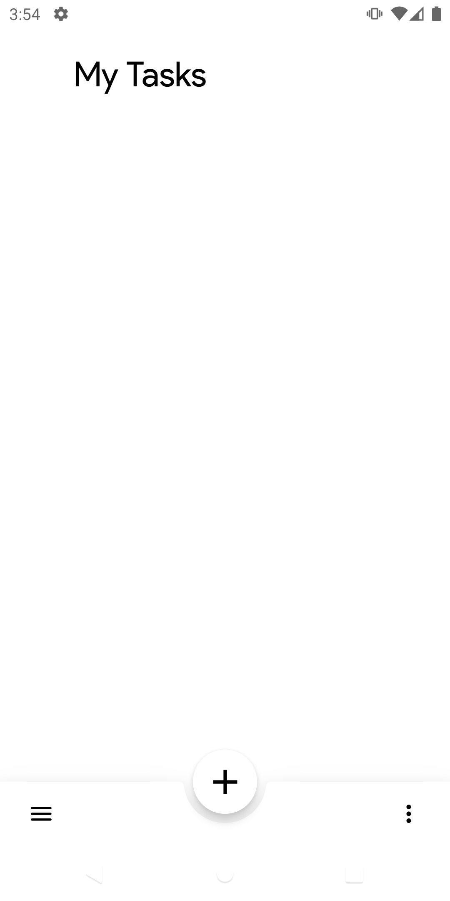
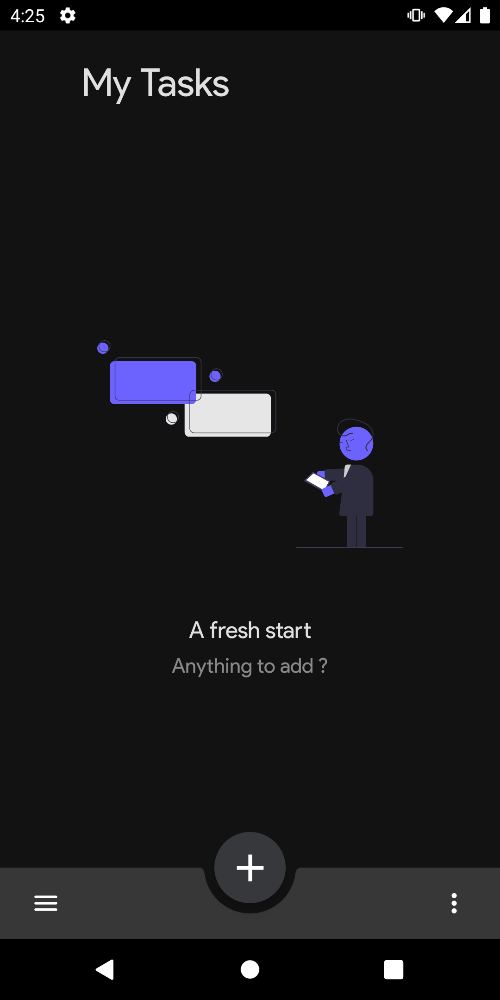
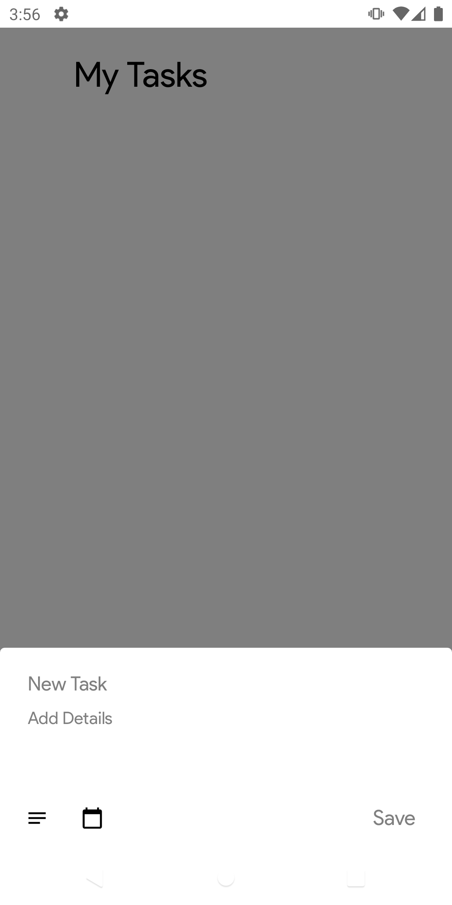
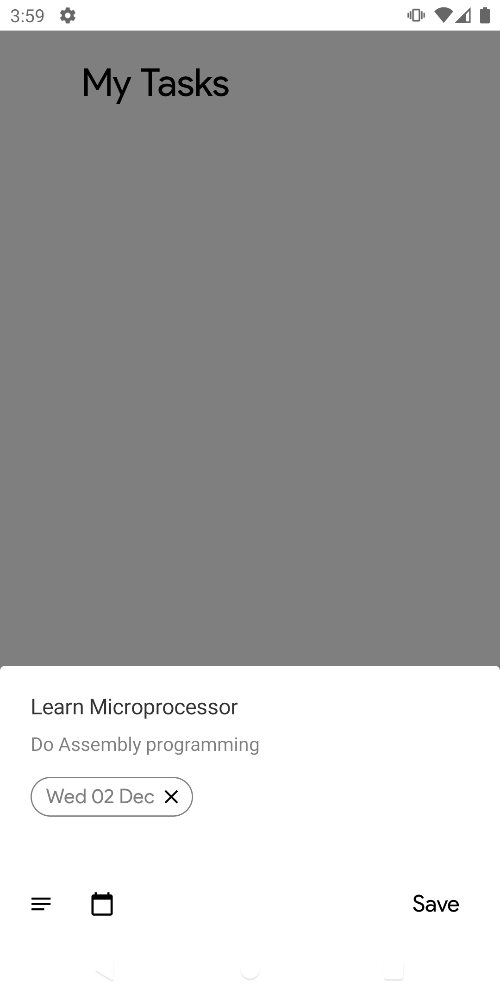
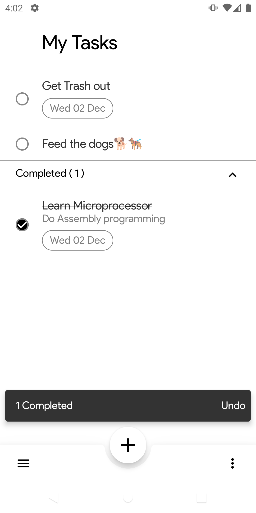
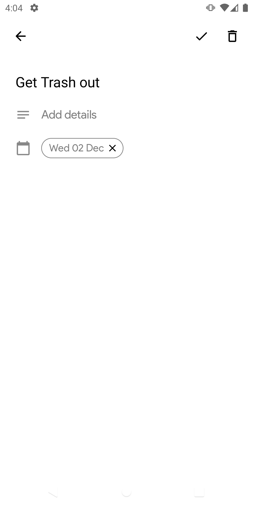
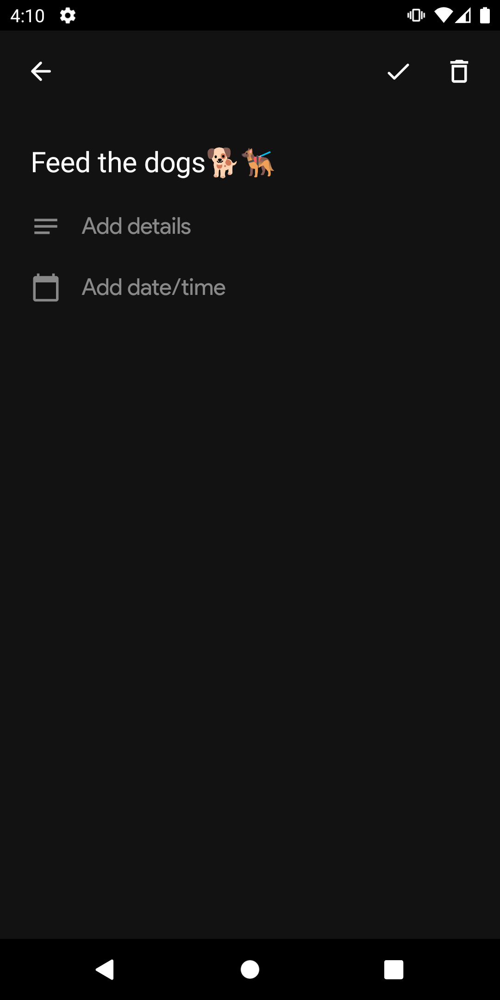
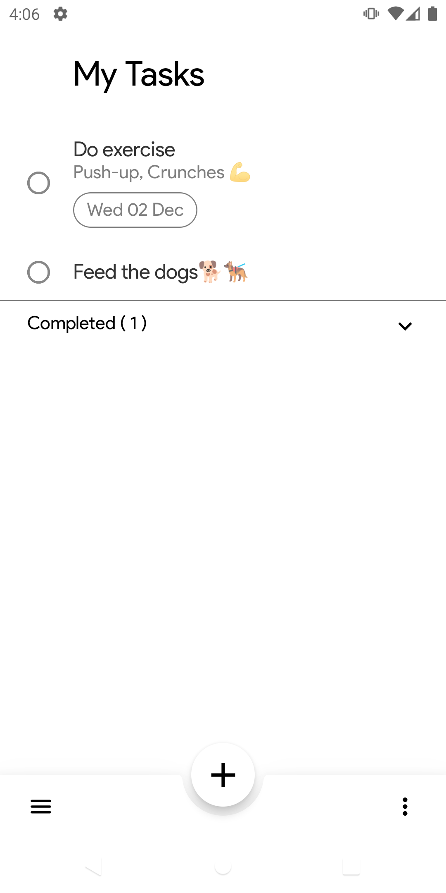
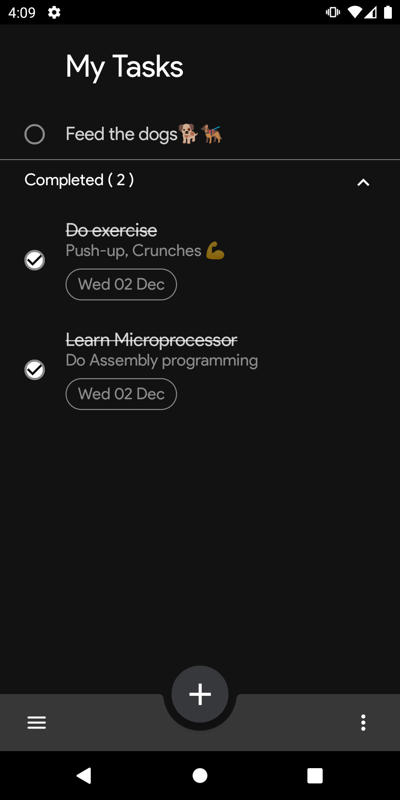

# JetTasks
Google Tasks clone built with Jetpack Compose

### Screenshots
<pre>
             
</pre>

## Status: 🚧 Work Under Progress 🚧
JetTasks is still under development and some features are not yet implemented.

## Libraries
* [Jetpack Compose](https://developer.android.com/jetpack/compose)
* [Navigation Compose](https://developer.android.com/jetpack/compose/navigation)

## License
```
Copyright 2020 Vivek Sharma

Licensed under the Apache License, Version 2.0 (the "License");
you may not use this file except in compliance with the License.
You may obtain a copy of the License at

    http://www.apache.org/licenses/LICENSE-2.0

Unless required by applicable law or agreed to in writing, software
distributed under the License is distributed on an "AS IS" BASIS,
WITHOUT WARRANTIES OR CONDITIONS OF ANY KIND, either express or implied.
See the License for the specific language governing permissions and
limitations under the License.
```
